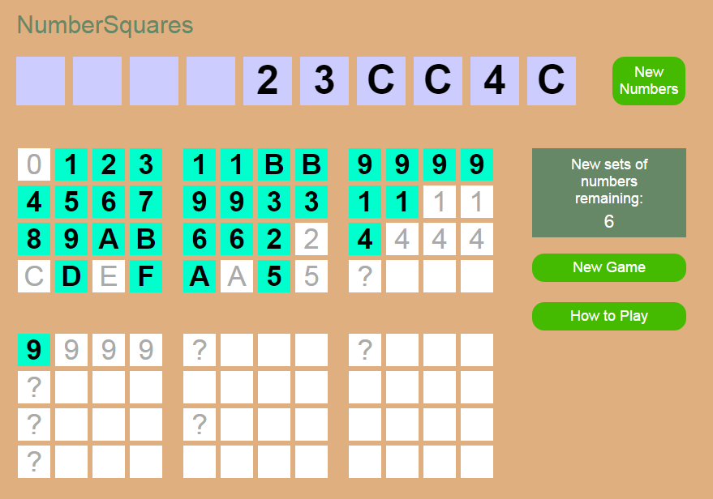

# NumberSquares
This game is about placing randomly generated numbers in the right positions to earn the most points.

### How to Play NumberSquares

The object of the game is to fill as many small squares, large squares and sections as possible with the random hexadecimal numbers that are provided.

There are six large squares on the screen and each has 16 small squares in it.  The gray numbers in the small squares show what number can be put there.  Each small square filled counts for one point.  If a large square has all the small squares in it filled, it is worth 32 points, 16 for each small square and another 16 for filling the whole large square.

Additional points can be scored for filling sections.  Each section has a '?' at the start of it.  What ever number is put in that square determines what number can go into the rest of the small squares in that section.  No number can be put in a small square while it is blank.  If a section is filled, another point is awarded for each small square in that section in addition to the points from single small squares or the 16 points for filling the whole large square if it is completely filled.  It is very hard to fill the last square because it requires all the small squares to be filled with the same number.  Because of how hard it is, filling that large square counts for 64 points rather than 48 as a special bonus.

The random numbers appear in the squares along the top when the 'new numbers' button is clicked.  These numbers are to be dragged one by one to the small squares that are marked for particular number being dragged.  Any number may be put on a '?'.  It is totally the player's choice, guess or strategy what it might be best to do with the question marks.  Ten sets of random numbers are allowed.  There is a countdown on the screen to show how many sets are left.  Sometimes, there are numbers left that cannot be legally placed.  If this happens, the player can still click "new numbers" and proceed to the next set or the end of the game.